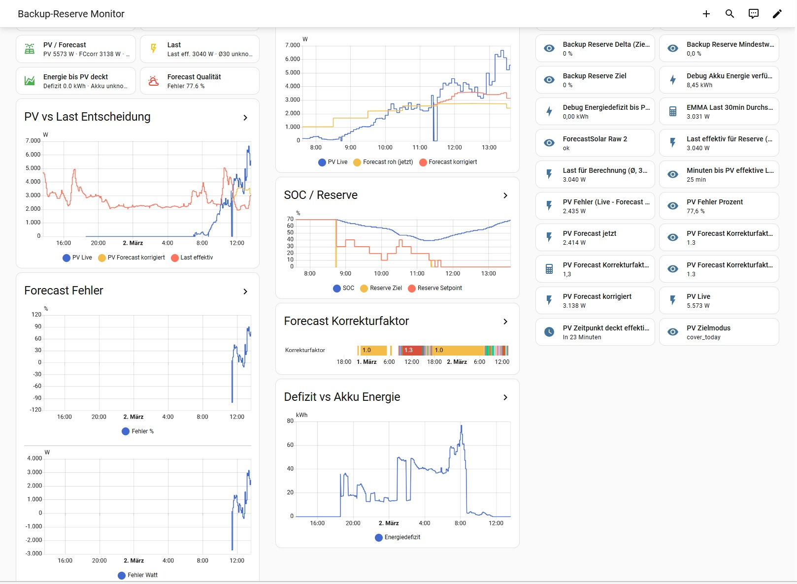

# Dynamic PV Backup Reserve Control for Huawei + Home Assistant

## Overview

This project implements a dynamic backup reserve control for a Huawei ESS system (e.g. MAP0 + SmartGuard + EMMA) using Home Assistant and Forecast.Solar.

Instead of keeping a fixed backup SOC (e.g. 30%), the system continuously calculates the minimum required battery reserve based on:

- Current 30-minute average house load  
- Forecasted PV production (Forecast.Solar API)  
- Effective usable battery capacity  
- Configured system efficiency  
- Daily peak cutoff logic  
- Time until next relevant PV production  

The inverter backup reserve (`number.wechselrichter_backup_power_ladestand`) is updated automatically in 10% steps.

---

## Current System Behavior

The system differentiates between:

- **Dynamic Target Reserve** (calculated)
- **Minimum Backup Hold** (hard safety floor)

Example:

- Calculated target reserve: 70%
- Hard minimum backup reserve: 80%
- Active state: `hold_80`

The hard minimum always has priority.

This prevents deep discharge during uncertain forecast conditions or long energy deficits.

---

## Core Idea

The system calculates how much battery energy is required to survive until PV production can take over the load again.

If the calculated reserve is below the configured minimum hold, the system keeps the minimum.

If above, the reserve increases in 10% steps (maximum 80%).

---

## Logic Flow

### 1. Determine Effective Load

Uses:

`sensor.emma_ladestrom` (30-minute mean)

Minimum enforced load = 1000 W  
(assumed blackout load after load shedding)

Effective Load:

```
Effective_Load = max(30min_avg_load, 1000W)
```

---

### 2. Peak Cutoff Logic

After the daily peak production time:

`sensor.power_highest_peak_time_today_2`

The system ignores remaining hours of today and evaluates starting from tomorrow 00:00.

This prevents late-afternoon false discharge decisions.

---

### 3. Determine PV Takeover Time

Using Forecast.Solar hourly forecast:

The system searches the first future hour where:

```
PV >= Effective_Load
```

Fallback condition:

```
PV >= 1000W
```

If neither condition is met:

→ FailSafe Mode

---

### 4. Energy Deficit Calculation

Energy required until takeover:

```
Energy_Deficit = Load × Time_until_takeover / Efficiency
```

Displayed via:

`sensor.pv_debug_energy_need_kwh`

Available battery energy:

`sensor.pv_debug_batt_energy_kwh`

If:

```
Energy_Deficit > Available_Energy
```

The system enters hold/red state.

Default efficiency = 90%

---

### 5. Reserve Ramp Behavior

Reserve is rounded UP in 10% steps.

Limits:

- Maximum reserve = 80%
- Minimum reserve = configurable
- Hard hold reserve = configurable (e.g. 80%)

Example ramp:

```
80% → 70% → 60% → 50% → … → 0%
```

When PV takeover is reached:

```
Reserve = 0%
```

---

## Modes

### tomorrow_morning

System evaluates survival until next PV morning window.

Used when:

- No relevant PV expected today
- After peak cutoff
- Night operation

---

## Status Sensor (Ampel)

The system exposes a status sensor:

| Status           | Meaning |
|------------------|----------|
| ok               | Load can be covered until PV takeover |
| fallback_1000w   | Only 1000W blackout load assumption |
| hold_80          | Hard reserve floor active |
| fail_safe_80     | No sufficient PV forecast available |
| red              | Energy deficit exceeds battery |

Designed for dashboard visualization.


---

## Debug Sensors

The system exposes:

- Minutes until PV takeover (`sensor.pv_minutes_until_cover`)
- PV takeover time (`sensor.pv_time_covers_effective_load`)
- Energy deficit (`sensor.pv_debug_energy_need_kwh`)
- Available battery energy (`sensor.pv_debug_batt_energy_kwh`)
- Dynamic reserve target
- Active reserve
- Forecast status

These allow full transparency of decision logic.


### PV-only battery charging (no grid charging)

The system allows the backup reserve setpoint to increase above the current
battery SOC **only when sufficient PV surplus is available**.

Conditions:
- Grid import must be below `cfg_grid_import_margin_w`
- PV surplus must exceed `cfg_pv_surplus_margin_w`

This ensures the battery is only charged from **solar energy**, never from
the grid due to reserve setpoint adjustments.
- Netzbezug ≤ `cfg_grid_import_margin_w` (Default: 100 W)
- PV-Überschuss (PV Live − effektive Last) ≥ `cfg_pv_surplus_margin_w` (Default: 500 W)

New Debug-Sensors:

- `sensor.debug_grid_import_w`
- `sensor.debug_pv_uberschuss_pv_last_eff`
- `sensor.debug_pv_only_uplift_erlaubt`

---

## FailSafe Mode

If no forecast hour satisfies:

```
PV >= 1000W
```

Then:

```
Backup Reserve = 80%
```

Used for:

- Multi-day cloudy periods
- Forecast API failure
- Severe winter scenarios

---

## Features

- Dynamic reserve calculation  
- Forecast-aware logic  
- Load-aware modeling  
- Daily peak cutoff protection  
- Hard minimum reserve floor  
- Energy deficit modeling  
- 10% smoothing ramp  
- 80% maximum cap  
- Automatic inverter update  
- Transparent debug sensors  
- Dashboard-ready status output  

---

## Requirements

- Home Assistant
- Forecast.Solar API
- Huawei inverter with modbus integration
- SmartGuard
- EMMA load sensor
- Battery capacity sensor
- Modbus integration
- Optional: Mushroom Cards

---

## Important Safety Notice

This system directly modifies inverter backup reserve values.

Before using:

- Verify correct battery capacity
- Validate efficiency factor
- Ensure blackout load shedding works
- Test fail-safe behavior

Incorrect configuration may result in:

- Unexpected discharge
- Early grid fallback
- Reduced backup autonomy

---

## Philosophy

This is not just a YAML script.

It is a predictive micro energy management system that aims to:

- Maximize self-consumption
- Minimize unnecessary reserve
- Maintain blackout readiness
- React dynamically to weather and load
- Provide full transparency of decisions

---

## Author

Created as a personal energy optimization experiment.  
Shared for educational and experimental purposes.
